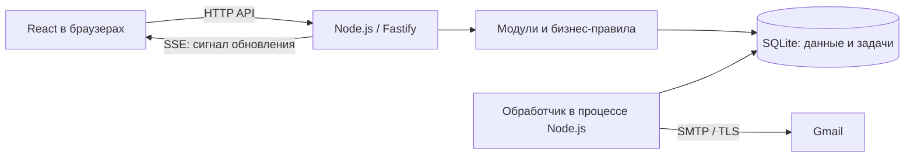

# ADR-001 — Архитектура локального MVP MyBooking

Дата: 30.09.2026. Статус: принято с изменениями [ADR-002](ADR-002.md) от 05.10.2026. Пункты о входе гостя, Drizzle, JSON Schema как источнике контракта, структуре каталогов и отсутствии Docker заменены ADR-002.

Основание: интервью с владельцем продукта; [PDR v1.1](PDR.md), [онтология v1.1](ONTOLOGY.md). Ограничения и бизнес-правила согласованы пользователем; выбор библиотек и технических механизмов делегирован автору ADR. Это проектное решение, а не отчёт о реализованном или проверенном приложении.

## Контекст

Нужно быстро получить работающий учебный MVP и сохранить возможность развития. Несколько знакомых используют один компьютер по очереди либо разные браузеры/профили. Приложение запускается вручную и работает только до остановки процесса. Интернет нужен для настоящих писем. Публичный сервер, PostgreSQL и Телемост относятся к следующим этапам.

Критические свойства: отсутствие пересекающихся подтверждённых встреч у любого участника, сохранение задач после перезапуска, изоляция данных пользователей, точная работа с часовыми поясами. Промышленный SLA и горизонтальное масштабирование сейчас не требуются.

## Решение

### 1. Модульный монолит и стек

Один репозиторий, один сервер Node.js, один локальный файл SQLite. Сервер обслуживает JSON HTTP API, собранный React-интерфейс, SSE и фоновые задачи. В разработке Vite работает отдельным процессом и проксирует API/SSE к серверу, сохраняя единый origin для браузера.

| Область | Выбор | Причина |
| --- | --- | --- |
| Язык и runtime | TypeScript со strict, поддерживаемая Node.js LTS | Единый язык клиента и сервера |
| Сервер | Fastify, JSON Schema для входных и выходных контрактов | Явная валидация и модульные маршруты |
| Интерфейс | React + Vite; CSS и стандартные браузерные API | Небольшая основа без SSR для закрытого кабинета |
| Данные | SQLite + better-sqlite3 + Drizzle ORM; Drizzle Kit для миграций | Локальный запуск без сервера БД, типизированные запросы и явный SQL |
| Время | @js-temporal/polyfill за модулем времени | Явное разделение локального времени, пояса и абсолютного момента |
| Почта | Nodemailer + Gmail SMTP | Уже имеющийся аккаунт отправителя |
| Проверки | Vitest; Fastify inject; Playwright | Логика, API и сценарии разных пользователей |

При создании проекта зафиксировать совместимые стабильные версии и Node.js в package.json и lockfile; не устанавливать RC автоматически из примеров документации. Проверить установку нативного better-sqlite3 на Windows. Этот ADR не задаёт непроверенные номера версий. Документация: [Fastify](https://fastify.dev/docs/latest/Reference/TypeScript/), [Vite](https://vite.dev/guide/), [Drizzle SQLite](https://orm.drizzle.team/docs/sqlite/get-started-sqlite), [Temporal polyfill](https://github.com/js-temporal/temporal-polyfill).

Предлагаемые границы каталогов: `apps/web`, `apps/server`, `packages/contracts`. На сервере модули `auth`, `profiles`, `availability`, `bookings`, `notifications`, `calendar-export`; инфраструктура БД и почты отделена от бизнес-правил. Контракты не экспортируют схему БД или секреты клиенту. Не создавать универсальный слой репозиториев для всех таблиц: выделить только операции, необходимые бизнес-сценариям и будущей замене хранилища.

### 2. SQLite и конкурентные изменения

Включить foreign_keys, WAL и ограниченное ожидание занятой БД. Файл находится на локальном диске, исключён из Git вместе с WAL/SHM и резервными копиями. Для времени встречи использовать UTC epoch milliseconds, для пояса — IANA ID; недельные часы и исключённые даты хранить отдельно как локальные значения.

Все команды, изменяющие заявки, занятость, расписание и пояс, проходят через общий транзакционный механизм. До чтения, определяющего возможность записи, начинается `BEGIN IMMEDIATE`. Подтверждение внутри одной короткой транзакции:

1. Проверяет участника, состояние заявки и срок по серверному времени, полученному после захвата транзакции.
2. Проверяет пересечения с confirmed у обоих участников в любой роли.
3. Подтверждает заявку и отклоняет все пересекающиеся pending с любым из этих участников.
4. Записывает переходы состояний и задачи уведомлений/напоминаний.
5. Фиксирует транзакцию; только после этого допускаются внешние вызовы и SSE.

SQLite допускает одного одновременного писателя; IMMEDIATE захватывает право записи до проверок. Это основание выбранного протокола, а не следствие однопоточности Node.js. При SQLITE_BUSY повторяется вся команда с повторными проверками в пределах ограниченного бюджета либо возвращается временная ошибка. Синхронная транзакция better-sqlite3 не содержит await и сетевых вызовов. [SQLite transactions](https://www.sqlite.org/lang_transaction.html), [better-sqlite3 API](https://github.com/WiseLibs/better-sqlite3/blob/master/docs/api.md).

Создание заявки использует тот же протокол, чтобы не вставить pending на занятый интервал одновременно с подтверждением. Изменение расписания применяет только просмотренный пользователем набор последствий: сервер повторно вычисляет его под блокировкой и отклоняет устаревшее подтверждение, требуя нового просмотра. Для HTTP-команд использовать ключ идемпотентности по PDR BOOK-01: для гостя область определяется подтверждением email или токеном конкретной заявки, для эксперта — сессией, действием и объектом. Результат сохранять атомарно; повтор с другим телом — конфликт.

Ограничения БД: внешние ключи, уникальные нормализованные email экспертов и publicId, допустимые состояния, start < end, уникальные ключи задач. У гостя нет обязательного `guestId`: самобронирование проверяется по нормализованному подтверждённому email согласно PDR AUTH-11. Защита от пересечений зависит от общего протокола записей; произвольное ручное редактирование файла БД им не покрывается.

### 3. Фоновые задачи и восстановление

Использовать таблицу Job как transactional outbox и очередь: тип, ссылка на событие/бронирование, адресат, scheduledAt, attempts, nextAttemptAt, status, leaseUntil, deduplicationKey. Задачи создаются вместе с изменениями данных. Отдельные Redis, брокер и сервис worker не нужны.

Обработчик в процессе сервера забирает задачи короткой транзакцией, выполняет сетевой вызов вне неё и сохраняет результат. Просроченная аренда позволяет восстановить processing после сбоя. Временные ошибки повторяются с ограничением и увеличением задержки; постоянные ошибки получают failed и диагностическое сообщение без секретов. Численные интервалы и лимиты фиксируются в спецификации уведомлений до реализации.

После запуска:

- Неотправленные статусные письма обрабатываются с указанием времени события; карточка содержит актуальное состояние.
- Просроченные напоминания пропускаются; истёкшие pending закрываются и порождают уведомления.
- Напоминания отменённых встреч не отправляются. Перед отправкой повторно проверяются статус и срок.
- Истёкшие коды входа не отправляются и не принимаются.

Точная политика просрочки напоминаний: при старте фиксируется момент R; все ещё не отправленные напоминания с scheduledAt < R пропускаются. При непрерывной работе допустимое запаздывание обработчика — до 60 секунд; позже задача помечается skipped. Пропущенное при подтверждении суточное напоминание не создаётся. Это технический допуск обработки, а не изменение порогов бронирования.

Гарантия очереди — повторяемая обработка с дедупликацией внутренних эффектов. Gmail SMTP не даёт атомарной транзакции с SQLite: сбой после принятия письма, но до сохранения sent может привести к повторному письму. Стабильный Message-ID полезен, но не гарантирует дедупликацию получателем. Отмена также не отзывает письмо, уже переданное SMTP; проверка перед отправкой уменьшает окно гонки. Успех отправки не равен доставке в ящик. Ошибка почты не отменяет встречу.

### 4. Вход и Gmail

Все пользователи входят по реальным одноразовым email-кодам; отправитель — Gmail владельца проекта. Это не вход через Google OAuth: адрес гостя может принадлежать другому провайдеру.

Использовать smtp.gmail.com:587, STARTTLS с обязательным TLS и пароль приложения из локального окружения. Обычный пароль аккаунта не использовать. У Google пароль приложения требует двухэтапной проверки и может быть недоступен для отдельных типов аккаунтов. Доступность на аккаунте владельца и реальная отправка пока не проверены; если способ недоступен, требуется отдельное решение о Gmail OAuth2 либо другом SMTP-провайдере, без фиктивного входа. [Google: пароли приложений](https://support.google.com/accounts/answer/185833), [Gmail SMTP](https://support.google.com/mail/answer/7104828?hl=en-GB), [Nodemailer SMTP](https://nodemailer.com/smtp).

Сервер хранит проверочное значение кода как HMAC с серверным секретом, срок, число попыток и отметку использования; погашение атомарно. Срок кода, число попыток, срок сессии и лимиты отправки заданы в PDR AUTH-08/09/12. Открытый код не сохранять в постоянную очередь: письмо с кодом отправляется непосредственно в обработчике входа после фиксации challenge, с сетевым таймаутом; после сбоя пользователь запрашивает новый код, старый инвалидируется. Для статусных писем используется постоянная очередь.

Сессии серверные в SQLite, в браузере — случайный непрозрачный токен в HttpOnly SameSite=Lax cookie; в БД хранится его хеш. Проверять права на каждый объект, Origin и CSRF-токен для изменяющих запросов. Локальный HTTP разрешён только на loopback; Secure-cookie включается для HTTPS при будущем деплое. Секреты и содержимое кодов/писем не логируются, .env не попадает в Git, .env.example содержит только имена и безопасные примеры.

Браузеры и профили имеют отдельные сессии; вкладки одного профиля разделяют вход. Последовательная работа на одном компьютере требует выхода предыдущего пользователя.

### 5. Обновления интерфейса

Выбрать SSE: сервер сообщает о необходимости перечитать данные, команды идут обычными HTTP-запросами. Передавать только события, разрешённые текущей сессии, без чужих деталей. Переподключение, возврат фокуса и старт страницы вызывают повторную загрузку актуальных данных. Поэтому потеря отдельного SSE-сигнала не теряет бизнес-изменение. При разрыве показывать статус соединения. При истечении/отзыве сессии закрывать поток.

SSE выбран вместо WebSocket, потому что двусторонние сообщения в постоянном канале не нужны; периодический polling остаётся возможной заменой, но не основным каналом. Очередь бизнес-задач не зависит от SSE.

### 6. Семантика времени

Согласованные правила отражены в PDR и онтологии:

- Самобронирование запрещено; диапазоны полуоткрытые [start, end), соседние встречи разрешены.
- Для подачи: now + 24 часа <= start <= now + 30 × 24 часа. Горизонт ограничивает начало; длительность — 15/30/60 фактических минут.
- Подтверждение и отмена гостем разрешены ровно за 3 часа; позже запрещены. Просроченность проверяется в команде независимо от worker.
- Часы выравниваются на :00/:15/:30/:45 в поясе организатора. Интервал через полночь вводится двумя частями; 24:00 допустимо только как конец дня. В MVP встреча должна помещаться в одну часть (TIME-03), объединение через полночь не вводится.
- Несуществующие при DST начала пропускаются. При повторении часа показываются оба разных UTC-момента с явным смещением. Конец вычисляется прибавлением фактической длительности; весь фактический интервал должен принадлежать доступности. Нельзя молча сдвигать несуществующее время библиотекой.
- Смена пояса сохраняет недельные часы, локальные исключённые даты и UTC-моменты существующих записей; ничего автоматически не отменяет. Старую pending можно подтвердить вне новых часов после смены пояса, проверив срок и занятость.

Вычисление доступности — чистый модуль с передаваемыми часами для тестов. На сервере повторяются все проверки; клиентское отображение не является разрешением операции. Для ICS использовать UTC, стабильный UID и требования RFC 5545 из PDR; выбор библиотеки сериализации оставить реализации после проверки экспорта с русским текстом.

### 7. Локальная эксплуатация и развитие

Сервер и dev-сервер слушают только loopback. Docker, публичный домен, внешний доступ и HTTPS-деплой сейчас не требуются. Нужны воспроизводимые команды установки, миграций, разработки, сборки и запуска; это требования к будущей реализации, таких команд в репозитории ещё нет.

Добавить ручные команды backup/restore и инструкцию. Backup делает согласованный снимок через SQLite Backup API, а не копирует один активный .db без WAL. Restore выполняется при остановленном приложении: сохранить текущую БД, проверить целостность и совместимость схемы копии, заменить набор файлов без старых WAL/SHM, затем проверить запуск. [SQLite Backup API](https://www.sqlite.org/backup.html).

Восстановление старой копии возвращает назад и состояния очереди, что может повторить уже отправленные письма. После restore автоматически не запускать отправку: сначала просмотреть восстановленные задачи и явно возобновить обработчик. История не удаляется автоматически, самостоятельное удаление аккаунта отложено до публичной эксплуатации.

Для PostgreSQL позже потребуются отдельные миграции схемы и перенос данных, новая реализация блокировок/ограничений и повтор конкурентных тестов. Это не замена одной строки подключения. Доменные правила и HTTP-контракты должны остаться независимыми от SQLite. Повод пересмотреть ADR — постоянный сервер, несколько экземпляров приложения или заметное ожидание записей.

Телемост полностью отложен из первого MVP: нет OAuth-настроек, задач создания конференций и обязательной видеоссылки. Сохранить границу для будущего адаптера, но не делать заглушку с вымышленным успехом. Подключение Яндекса и прежний AC-15 относятся к следующему этапу.

## Рассмотренные альтернативы

| Альтернатива | Почему не выбрана сейчас | Когда вернуться |
| --- | --- | --- |
| PostgreSQL сразу | Пользователь выбрал SQLite; отдельный сервер усложняет локальную демонстрацию | Публичный запуск и рост конкуренции |
| Prisma | Допустимый вариант; выбран более близкий к SQL Drizzle для явного протокола SQLite | При пересмотре слоя данных |
| Микросервисы, Redis, отдельный worker | Дополнительные процессы и эксплуатация без потребности масштаба | Независимое масштабирование задач |
| Next.js / SSR | Закрытому локальному кабинету не требуется серверный рендеринг | Публичные индексируемые страницы |
| WebSocket | Постоянный двусторонний канал не нужен | Совместное редактирование или иные двусторонние сценарии |
| Только таймеры в памяти | Теряются после остановки | Не использовать для постоянных задач |

## Последствия

Быстрый локальный старт, единый язык, сохранение данных и очереди, явные границы модулей. Цена решения: один писатель SQLite, кратковременное блокирование event loop синхронными запросами, зависимость входа от интернета и Gmail, отсутствие отправки при выключенном приложении. Нельзя обещать круглосуточные напоминания или ровно однократную доставку SMTP. Перенос в PostgreSQL и публичная эксплуатация потребуют отдельной работы.

## Проверка реализации

| Проверка | Связь с PDR |
| --- | --- |
| Вход двух пользователей в изолированных browser contexts, повтор кода отклоняется, чужие записи недоступны | AC-01/02 |
| Границы 24 часа / 3 часа / 30 суток, соседние встречи, обе DST-ветви, исключения и смена пояса | AC-03–05/11 |
| Два конкурирующих подтверждения с общим участником в разных ролях; отдельные подключения к одной временной SQLite | AC-06–08 |
| Одновременные подача/подтверждение и изменение расписания/подтверждение | AC-07/08/10 |
| Сбой после commit, восстановление задачи, повтор HTTP, просроченные и отменённые напоминания | AC-13/18 |
| Реальные Gmail-коды, статусные письма, ICS с кириллицей; без SMTP реальную приёмку не объявлять успешной | AC-01/13/16 |
| SSE между браузерами, потеря и восстановление соединения | AC-17 |
| Backup/restore, сохранность данных и явное возобновление очереди | AC-19 |

Автоматические тесты не отправляют реальные письма; транспорт подменяется только в тестах. Пользовательский локальный режим использует настоящий Gmail. Параметры auth заданы в PDR v1.5; до реализации остаются параметры повторов очереди и точные API/схема — это задачи спецификаций, не блокирующие выбор архитектуры. Тесты и резервное восстановление в рамках написания ADR не выполнялись.
