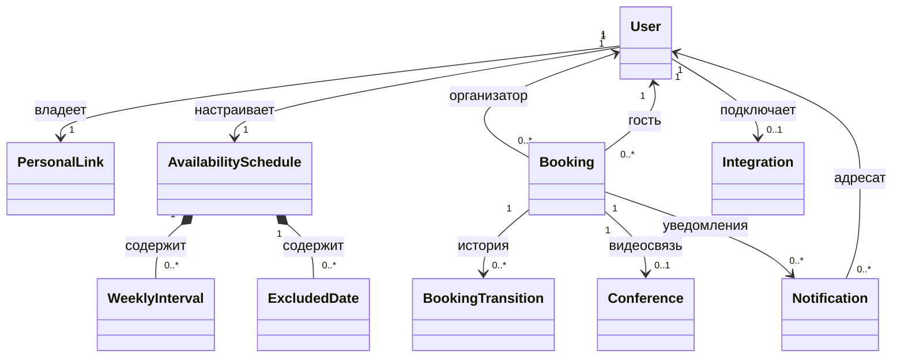

# MyBooking — онтология предметной области

Версия: 1.1. Дата: 30.09.2026. Источник: [PDR v1.1](PDR.md), [ADR-001](ADR-001.md).

Статус: концептуальная модель, выведенная из PDR для дальнейшей разработки спецификаций. Это общий словарь понятий, отношений и правил, а не схема базы данных. Документ не утверждает технические предложения PDR и не заменяет его.

Обозначения: **Требование** — явно зафиксировано в PDR; **Модель** — способ представить требования в онтологии; **Предложение** — решение PDR, ещё требующее фиксации в спецификации; **Открыто** — семантика пока не определена. Ссылки на разделы используются там, где в PDR нет ID требования.

## 1. Границы предметной области

Предметная область — согласование индивидуальных встреч между зарегистрированными пользователями посредством заявок с ручным подтверждением. Основные области: пользователи и доступ; расписание и доступность; жизненный цикл бронирования; уведомления и календарный экспорт; необязательная видеосвязь (следующий этап; в первом MVP не реализуется).

Оплата, команды, групповые встречи, каталог пользователей и синхронизация внешних календарей находятся за пределами модели MVP.

## 2. Основные понятия

| Понятие | Определение и существенные свойства | Основание |
| --- | --- | --- |
| Пользователь (`User`) | Зарегистрированный человек: email, имя, выбранный часовой пояс, уникальный идентификатор личной ссылки. Может принимать и подавать заявки. | AUTH-01–06 |
| Организатор (`Organizer`) | Роль пользователя в конкретном бронировании: предоставляет время и принимает решение по заявке. Не отдельный тип аккаунта. | §1, AUTH-06 |
| Гость (`Guest`) | Роль пользователя в конкретном бронировании: выбирает время и подаёт заявку. Не отдельный тип аккаунта. | §1, AUTH-06 |
| Личная ссылка (`PersonalLink`) | Адрес календаря одного пользователя с автоматически созданным уникальным идентификатором. Знание адреса не даёт доступ без входа. | AUTH-03/04, §9 |
| Расписание (`AvailabilitySchedule`) | Набор недельных интервалов и исключённых дат одного владельца. Часы интервалов трактуются в поясе владельца. Выделение единого понятия — Модель. | TIME-01/12 |
| Недельный интервал (`WeeklyInterval`) | День недели, локальное начало и локальный конец периода приёма встреч. На один день допускается несколько интервалов. | TIME-01 |
| Исключённая дата (`ExcludedDate`) | Локальная календарная дата, полностью исключённая владельцем из расписания. | TIME-01/12 |
| Бронирование (`Booking`) | Единый объект согласования: организатор, гость, начало, конец, тема, описание и состояние. Сохраняет идентичность при подтверждении и закрытии. Выбор единого объекта — Модель, согласующаяся с §5/9. | §4/5/9 |
| Ожидающая заявка (`PendingRequest`) | Бронирование в состоянии ожидания решения; ещё не резервирует время. | TIME-09, §4.2 |
| Подтверждённая встреча (`ConfirmedMeeting`) | Бронирование, подтверждённое организатором; резервирует интервал у обоих участников. | TIME-07, §4.3 |
| Переход состояния (`BookingTransition`) | Факт изменения состояния: бронирование, прежнее и новое состояния, момент, инициатор и причина. Отдельный журнал — Предложение PDR. | §5/9 |
| Слот (`Slot`) | Вычисляемый кандидат на встречу для конкретных организатора, гостя, длительности и момента проверки. Не самостоятельная бронь и не гарантия будущей доступности. | TIME-02–09; Модель |
| Занятость (`Occupancy`) | Производное от подтверждённой встречи ограничение времени каждого её участника независимо от роли. | TIME-07 |
| Подключение Яндекса (`Integration`) | Необязательная связь пользователя с его собственным внешним аккаунтом. | §7.1 |
| Видеоконференция (`Conference`) | Внешняя видеовстреча и ссылка для конкретного подтверждённого бронирования; имеет отдельное состояние подготовки. | §4.3/5/7.1 |
| Уведомление (`Notification`) | Сообщение определённому адресату о событии бронирования. | NOTIFY-01–07 |
| Напоминание (`Reminder`) | Уведомление, запланированное относительно начала подтверждённой встречи: за 24 часа или за 1 час. | NOTIFY-06 |
| Календарный экспорт (`CalendarExport`) | ICS-представление встречи для скачивания и вложения в письмо. Не обеспечивает синхронизацию или RSVP. | ICS-01/02, §6 |

Код входа, сессия, очередь заданий и outbox — вспомогательные технические понятия из §9/10 PDR. Они обеспечивают доступ и надёжное выполнение действий, но не являются участниками встречи или состояниями бронирования. Тема интерфейса — настройка представления пользователя.

## 3. Отношения и кратности

| Отношение | Кратность и смысл |
| --- | --- |
| Пользователь владеет личной ссылкой | У каждого пользователя одна личная ссылка; у ссылки один владелец. |
| Пользователь владеет расписанием | В модели одно расписание на пользователя; оно может быть пустым. |
| Расписание содержит недельные интервалы | 0..N интервалов; каждый принадлежит одному расписанию. |
| Расписание содержит исключённые даты | 0..N исключений; каждое принадлежит одному расписанию. |
| Пользователь организует бронирование | У бронирования ровно один организатор; пользователь организует 0..N бронирований. |
| Пользователь участвует как гость | У бронирования ровно один гость; пользователь имеет 0..N бронирований в этой роли. |
| Бронирование имеет переходы состояния | 0..N записей истории в предлагаемом журнале. |
| Подтверждённая встреча создаёт занятость | Ограничивает время организатора и гостя; отдельных сохраняемых записей занятости онтология не требует. |
| Пользователь подключает Яндекс | В модели 0..1 текущее подключение; поддержка нескольких подключений не определена. |
| Бронирование имеет видеоконференцию | В модели 0..1 логический результат создания видеоссылки. Это не гарантия отсутствия внешних дубликатов при сбоях API. |
| Событие бронирования порождает уведомления | 0..N адресных сообщений; каждому сообщению соответствует один адресат. |
| Встреча представляется календарным экспортом | Экспорт можно формировать повторно; это представления одной встречи, а не новые встречи. |

Ровно один организатор и один гость означают две ролевые позиции. Это обязательно разные пользователи: самобронирование запрещено (PDR v1.1).

Диаграмма показывает концептуальные отношения, включая предложенный журнал и выбранные кратности модели; она не задаёт таблицы или внешние ключи.

## 4. Свойства бронирования и временные понятия

| Свойство | Семантика |
| --- | --- |
| Идентичность | Одна заявка после подтверждения остаётся тем же бронированием. Перенос создаёт другое бронирование после отмены исходного (§4.5). |
| Участники | Организатор и гость определяются для этой записи, а не глобально для пользователя. |
| Начало и конец | Фактические моменты времени; смена пояса профиля их не меняет (TIME-13). UTC для хранения — Предложение PDR. |
| Длительность | 15, 30 или 60 минут; выбирается гостем (TIME-02). |
| Тема | Обязательный обычный текст, не более 120 символов (§4.2). |
| Описание | Необязательный обычный текст, не более 2000 символов (§4.2). |
| Состояние | Стадия согласования или результат закрытия; названия кодов предложены в §5. |
| Системная причина | Категория изменения, например конфликт или изменение расписания; предлагаемые коды: `manual`, `conflict`, `schedule_changed`, `deadline`. |
| Комментарий причины | Необязательный текст участника при отклонении, отзыве или отмене. Отличается от системной категории. |
| Инициатор изменения | Пользователь либо системный процесс; способ хранения — часть будущей спецификации. |

Недельные часы, исключённая дата, часовой пояс и абсолютный момент — разные понятия. Смена пояса сохраняет локальные часы расписания и абсолютное время существующих бронирований; автоматической отмены нет (TIME-12/13). Исключённые даты сохраняют календарное значение в новом поясе. Несуществующее время при DST пропускается, повторяющееся даёт два UTC-момента с явным смещением. Интервал через полночь задаётся двумя частями; встреча помещается в одну часть.

## 5. Вычисляемые понятия и ограничения

### 5.1. Доступность

Слот доступен для подачи заявки, когда одновременно выполняются условия:

1. Длительность разрешена, начало соответствует шагу 15 минут (TIME-02).
2. Встреча целиком входит в один интервал расписания организатора и не попадает на исключённую дату (TIME-01/03).
3. До начала не менее 24 часов, оно находится в горизонте 30 дней (TIME-04).
4. Ни организатор, ни гость не имеют пересекающейся подтверждённой встречи в любой роли (TIME-07/08).

Сервер повторяет проверку при подаче и проверяет срок подтверждения и занятость при подтверждении. Ожидающие заявки не делают слот занятым. Параметры времени общие для всех пользователей (TIME-09/11).

**Принятая формализация из PDR:** интервал `b = [start(b), end(b))`; два интервала пересекаются, если `start(a) < end(b)` и `start(b) < end(a)`. Поэтому соседние встречи допустимы без перерыва. `participants(b)` — множество пользователей в обеих ролях.

Тогда инвариант отсутствия двойного бронирования: для любых разных подтверждённых `a` и `b`, если `participants(a)` и `participants(b)` имеют общего пользователя, их интервалы не пересекаются. Запрет и полуоткрытая семантика согласованы.

Собственное расписание гостя не ограничивает его участие у другого организатора — Предложение PDR. Доступность всегда зависит от выбранного гостя и момента проверки, а не только от календаря организатора.

### 5.2. Подтверждение и конфликты

Подтверждение доступно организатору для ожидающей заявки до предельного срока за 3 часа до начала (TIME-05). В одной атомарной операции:

1. Бронирование становится подтверждённым и блокирует время обоих участников.
2. Закрываются все остальные ожидающие заявки, которые пересекаются по времени и содержат хотя бы одного из этих участников в любой роли (TIME-10).

В предлагаемом автомате конфликтующие заявки переходят в `rejected` с причиной `conflict`. Нельзя проверять конфликты только по организатору: например, подтверждение встречи Анны с Борисом закрывает пересекающуюся заявку Бориса к Виктору.

Создание видеоссылки выполняется после подтверждения; сбой Телемоста не отменяет подтверждение (§4.3). Независимость подтверждения от сбоя email закреплена в ADR-001. Телемост в первом MVP не вызывается.

### 5.3. Отмена и изменение расписания

Гость отменяет подтверждённую встречу не позднее чем за 3 часа до начала, организатор — в любой момент до начала (TIME-06). Отмена освобождает время у обоих; для новой заявки всё равно действуют все ограничения доступности.

Изменение интервалов или исключённых дат требует показа затронутых будущих встреч и ожидающих заявок владельца как организатора. После явного согласия встречи вне нового расписания отменяются, заявки отклоняются; без согласия изменение не применяется (§4.6). Исключение записей, где владелец выступает гостем, и защита предварительного списка версией сформулированы в PDR как предложения. Смена пояса — отдельная операция без автоматических отмен.

## 6. Жизненный цикл бронирования

Коды состояний и причин ниже — предложенная в PDR модель согласованных процессов.

| Из состояния | Действие / событие | Инициатор | В состояние | Условие / причина |
| --- | --- | --- | --- | --- |
| Нет записи | Подача заявки | Гость | `pending` | Проверены данные и доступность |
| `pending` | Подтверждение | Организатор | `confirmed` | Соблюдены срок и отсутствие конфликтов |
| `pending` | Отклонение | Организатор | `rejected` | `manual`; комментарий необязателен |
| `pending` | Отзыв | Гость | `withdrawn` | Комментарий необязателен |
| `pending` | Истечение | Система | `expired` | `deadline` |
| `pending` | Подтверждение пересекающейся заявки | Система | `rejected` | `conflict` |
| `pending` | Согласованное изменение расписания | Владелец / система | `rejected` | `schedule_changed` |
| `confirmed` | Отмена | Один из участников | `cancelled` | В пределах срока для его роли |
| `confirmed` | Согласованное изменение расписания | Владелец / система | `cancelled` | `schedule_changed`, будущая встреча вне расписания |

`rejected`, `withdrawn`, `expired`, `cancelled` — терминальные состояния. Автоматического восстановления отклонённых заявок PDR не предусматривает как предлагаемое правило. Перенос — отмена и новая заявка с новым подтверждением.

«Завершена» — вычисляемое представление подтверждённой встречи после окончания её времени, а не отдельный переход и не подтверждение фактического участия. История хранится без автоматического удаления (§9).

**Согласованная граница срока:** ровно за 3 часа подтверждение и отмена гостем разрешены, при меньшем остатке — запрещены. Просроченная ожидающая запись семантически истекла, даже если фоновая задача ещё не обновила её состояние. Горизонт подачи ограничивает начало включительно: now + 24 часа <= start <= now + 30 × 24 часа. Это согласованное решение.

## 7. События, уведомления и внешние результаты

Названия событий — Модель для будущих спецификаций, а не готовый контракт API.

| Событие | Получатели / результат | Основание |
| --- | --- | --- |
| `BookingRequested` | Организатору — новая заявка; гостю — подтверждение получения | NOTIFY-01 |
| `BookingConfirmed` | Обоим — детали, ICS и ссылка при наличии; планирование напоминаний и необязательной видеоконференции | NOTIFY-02/06, §4.3 |
| `BookingRejected` / `BookingExpired` | Гостю — статус и причина при наличии | NOTIFY-03 |
| `BookingCancelled` | Другому участнику — детали и причина при наличии | NOTIFY-04 |
| `BookingClosedByConflict` / `BookingClosedBySchedule` | Затронутым участникам — новый статус и системная причина | NOTIFY-05 |
| `ReminderDue` | Обоим — напоминание за 24 часа или за 1 час; прошедшие к подтверждению сроки не догоняются | NOTIFY-06 |
| `ConferenceReady` после подтверждения | Участникам — отдельное письмо со ссылкой; ссылка появляется в карточке | NOTIFY-07 |
| `BookingWithdrawn` | Уведомление организатору предложено, но не согласовано отдельно | §6, Предложение |

Состояние бронирования, состояние создания видеоссылки и состояние доставки письма независимы. Ошибка отправки или генерации ссылки не является состоянием `rejected`.

Предложенные состояния видеоссылки: `not_connected`, `queued`, `ready`, `retrying`, `failed`. `not_connected` можно представлять отсутствием видеоконференции, а не внешним объектом. Без подключения Яндекса фоновые попытки создания ссылки не запускаются. Чей именно аккаунт применяется, если подключение есть у обоих участников, необходимо явно закрепить; использование аккаунта организатора — кандидат на решение, а не добавленное требование.

Отмена оставшихся напоминаний принята в PDR v1.1 и ADR-001. После перезапуска просроченные напоминания пропускаются, статусные письма обрабатываются, истёкшие заявки закрываются. Внутренние эффекты защищены дедупликацией, но после сбоя SMTP возможен повтор письма. Передача письма провайдеру не означает гарантированной доставки. ICS — снимок сведений: новая версия файла со ссылкой не обновляет ранее импортированное событие автоматически.

## 8. Права доступа как отношения

| Субъект | Доступ / действие | Основание |
| --- | --- | --- |
| Неавторизованный посетитель | Не просматривает календарь даже по личной ссылке | AUTH-04 |
| Авторизованный посетитель | Видит доступность организатора и свои заявки; не видит чужие имена, темы и детали | AUTH-05 |
| Владелец профиля | Меняет своё имя и пояс, настраивает расписание и необязательное подключение | AUTH-02/06, UI-09 |
| Организатор конкретного бронирования | Рассматривает, подтверждает или отклоняет ожидающую заявку; отменяет встречу по сроку своей роли | §4, TIME-06 |
| Гость конкретного бронирования | Отзывает свою ожидающую заявку; отменяет свою встречу по сроку своей роли | §4, TIME-06 |
| Посторонний пользователь | Не получает детали чужого бронирования через интерфейс или прямое обращение к API | AUTH-05, AC-02 |

Проверка права зависит от пользователя и конкретного объекта. Случайный идентификатор личной ссылки не заменяет авторизацию.

## 9. Реестр уточнений и оставшихся вопросов

| Вопрос | Что уже известно / что необходимо решить |
| --- | --- |
| Самобронирование — решено | Запрещено, организатор и гость различны. |
| Границы времени — решено | Включительные границы 24 часа/3 часа/30 суток, полуоткрытые интервалы; выравнивание по поясу организатора. |
| DST и полночь — решено | Несуществующее время пропускается, повторяющееся представляется двумя моментами; интервалы через полночь разделяются на две части. |
| Пояс и исключённые даты — решено | Исключение сохраняет календарную дату в новом поясе. |
| Подтверждение после смены пояса — решено | Старую заявку вне новых часов можно подтвердить с проверкой срока и занятости. |
| Выбор аккаунта видеосвязи | Закрепить владельца подключения для встречи и поведение при отключении аккаунта во время подготовки ссылки. |
| Сроки отзыва и отклонения | Определить обработку команды, поступившей одновременно с истечением ожидающей заявки. |
| Техническая надёжность | Базовые механизмы и ограничения SMTP приняты в ADR-001; численные параметры повторов и детали контрактов остаются спецификациям. |
| Внешние доступы | Gmail выбран, реальный SMTP-доступ ещё не проверен. Телемост и доступ к Яндексу отложены до следующего этапа. |
| Удаление данных | История сохраняется; самостоятельное удаление аккаунта отложено до публичной эксплуатации. Для локального MVP согласованы ручные backup/restore. |

## 10. Контрольные вопросы к онтологии

| Вопрос | Ответ модели | Проверка PDR |
| --- | --- | --- |
| Может ли человек быть организатором одной встречи и гостем другой? | Да, роль принадлежит отношению с бронированием. | AC-02/06 |
| Допустимы ли несколько заявок на одинаковое время? | Да, пока они ожидающие и остальные правила соблюдены. | AC-07 |
| Может ли подтверждение заблокировать время гостя у третьего пользователя? | Да, занятость учитывается независимо от роли. | AC-06–08 |
| Отменяется ли встреча при ошибке Телемоста? | Нет, состояние видеоссылки независимо от подтверждения. | AC-14/15 |
| Меняется ли фактическое время встречи при смене пояса? | Нет; меняется представление времени. | AC-11 |
| Становится ли освобождённый слот сразу доступным для новой заявки? | Только если выполнены все правила, включая минимум 24 часа. | AC-09 |
| Можно ли считать окончившуюся встречу состоявшейся? | Нет, модель знает окончание времени, но не факт участия. | §5 |
| Обновляет ли новый ICS импортированную запись автоматически? | Нет, это экспорт без синхронизации. | AC-16 |

Дальнейшие спецификации должны использовать этот словарь, ссылаться на ID PDR и явно фиксировать решения открытых вопросов. При изменении требований сначала обновляется PDR, затем онтология и связанные спецификации.
